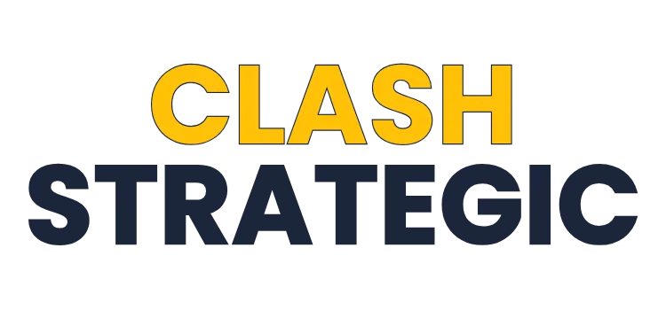

# Clash Strategic™ Web Application

  
  
  
  
  
  
  

## 📑 Table of Contents

- [About](#-about)
- [Key Features](#-key-features)
- [Live Demo](#-live-demo)
- [Technology Stack](#-technology-stack)
- [Contributing](#-contributing)
- [License](#-license)
- [Support & Contact](#-support--contact)
- [Acknowledgments](#-acknowledgments)

## 📱 About

**Clash Strategic™** is a comprehensive Progressive Web Application (PWA) designed for the Clash Royale community. It provides strategic tools, deck building capabilities, card analysis, and community features to help players improve their gameplay and connect with other strategists.

### 🌟 Key Features

- **🏗️ Advanced Deck Builder**: Create, analyze, and optimize your Clash Royale decks
- **📊 Deck Analysis**: Get detailed statistics including elixir cost, cycle analysis, and strategic insights
- **🃏 Card Management**: Browse and manage all Clash Royale cards with detailed statistics
- **👥 Community Hub**: Connect with other players through chat and publications
- **📱 PWA Support**: Install as a native app on mobile and desktop devices
- **🔄 Real-time Updates**: Automatic content updates and notifications
- **🎮 Game Integration**: Direct deck copying to Clash Royale
- **🔐 Secure Authentication**: Google OAuth and guest access support
- **🌐 Offline Support**: Service worker enables offline functionality
- **📈 Performance Optimized**: Fast loading with intelligent caching

## 🚀 Live Demo

Visit the live application: <a href="https://clashstrategic.great-site.net" target="_blank" rel="noopener noreferrer">https://clashstrategic.great-site.net</a>

## 🛠️ Technology Stack

### Frontend

- **JavaScript ES6+** - Modern JavaScript with modules
- **HTML5 & CSS3** - Semantic markup and responsive design
- **jQuery** - DOM manipulation and AJAX requests
- **Progressive Web App** - Service worker, manifest, offline support

### Backend (Clash Strategic API)

The clash strategic api is the server that is requested with webapp to retrieve and store information.

- **RESTful API** - A dedicated backend API handles all data retrieval and storage. [API Documentation (pending)](https://github.com/ClashStrategic/webapp/blob/main/API_ENDPOINTS.md)

### Development Tools

- **Jest** - Unit testing framework
- **Playwright** - End-to-end testing
- **ESLint** - Code linting and quality
- **Babel** - JavaScript transpilation
- **Semantic Release** - Automated versioning and releases

### Build & Deployment

- **Service Worker** - Caching and offline functionality
- **XAMPP** - Local development environment

## 🤝 Contributing

We welcome contributions from developers of all skill levels!

For detailed guidelines, setup instructions, and development tips, see our [**Contributing Guide**](CONTRIBUTING.md).

## 📄 License

This project is licensed under the Apache License 2.0 - see the [LICENSE](LICENSE) file for details.

## 🆘 Support & Contact

- **Issues**: [GitHub Issues](https://github.com/ClashStrategic/webapp/issues)
- **Discussions**: [GitHub Discussions](https://github.com/ClashStrategic/webapp/discussions)
- **Website**: [https://clashstrategic.great-site.net](https://clashstrategic.great-site.net)

## 🙏 Acknowledgments

- **Clash Royale** by Supercell for the amazing game
- **Community Contributors** who help improve the application
- **Open Source Libraries** that make this project possible

---

  
💖 Thank you for being part of the Clash Strategic community

  

    <a href="#top">Back to Top ⬆️</a>
  

